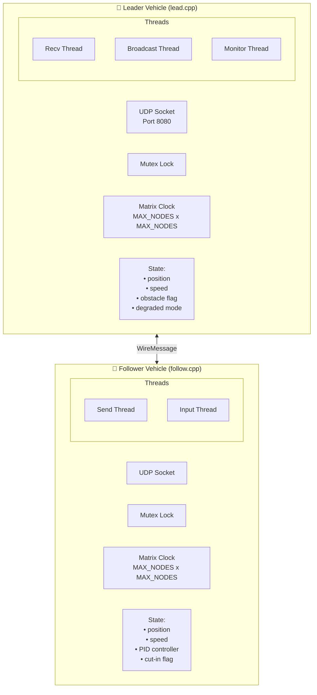
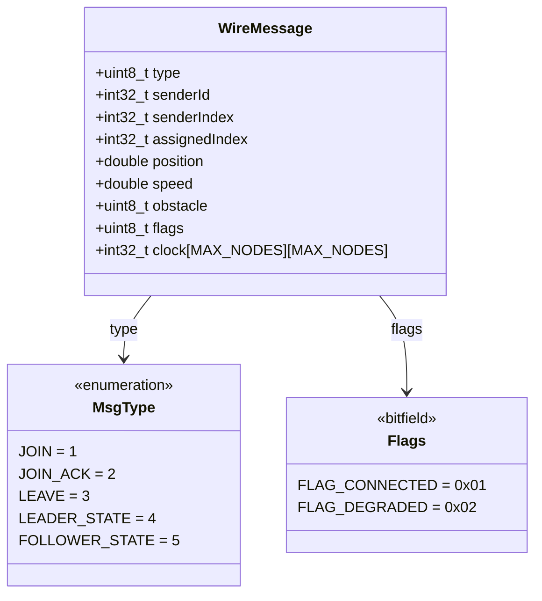
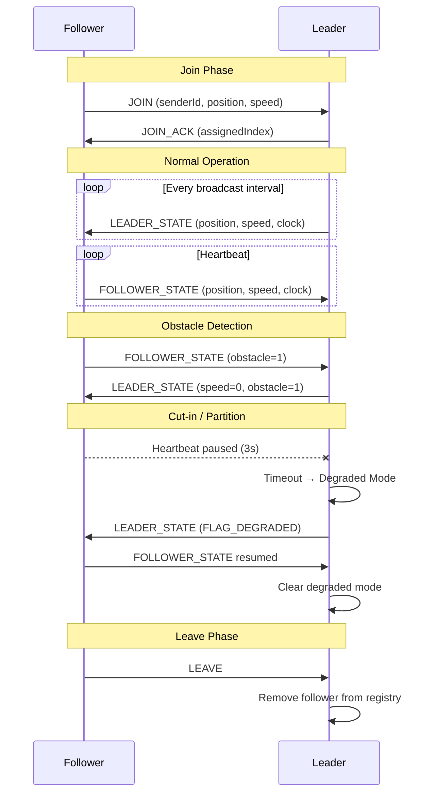
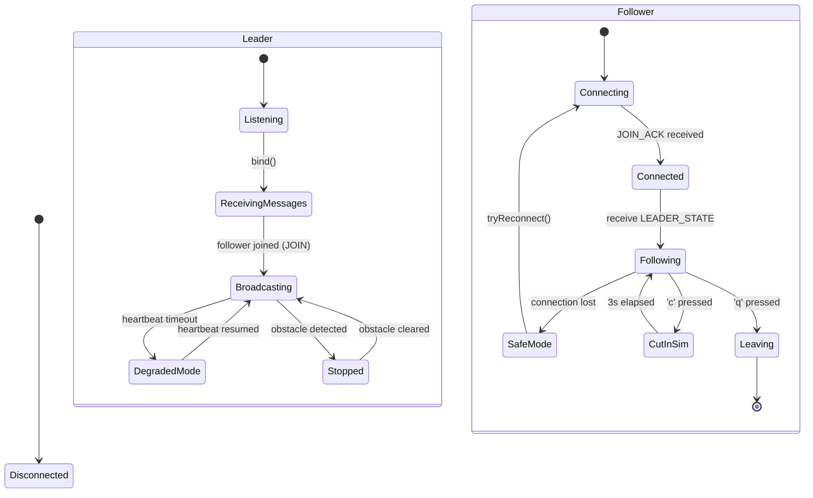
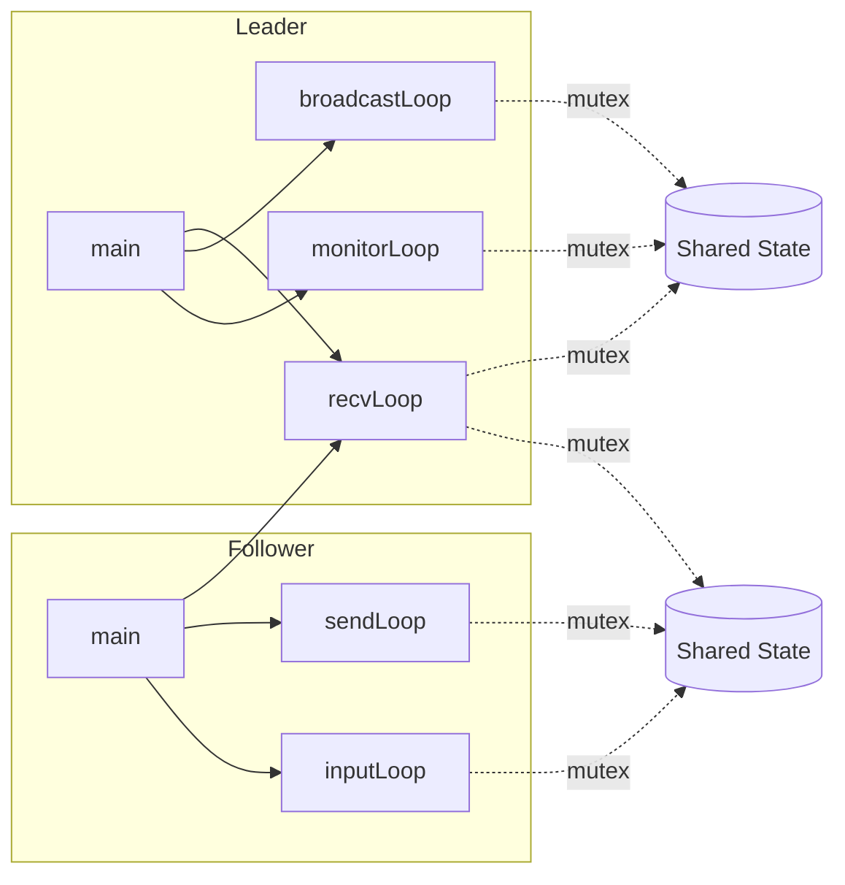
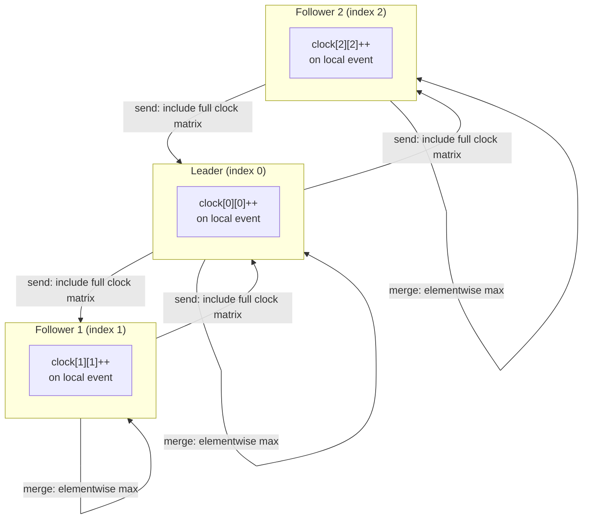
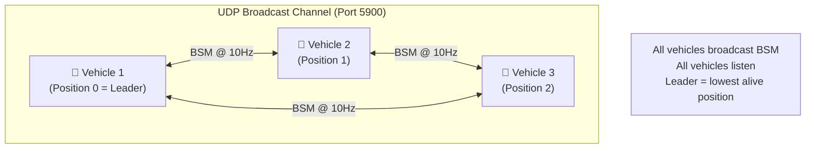
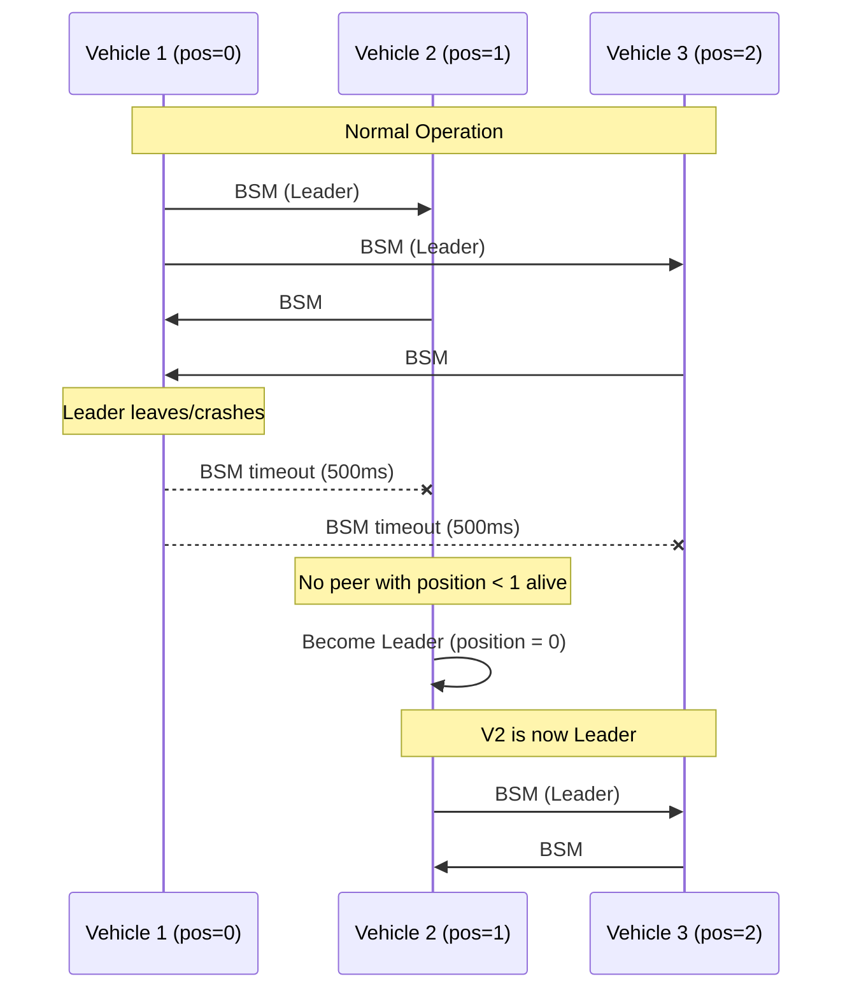
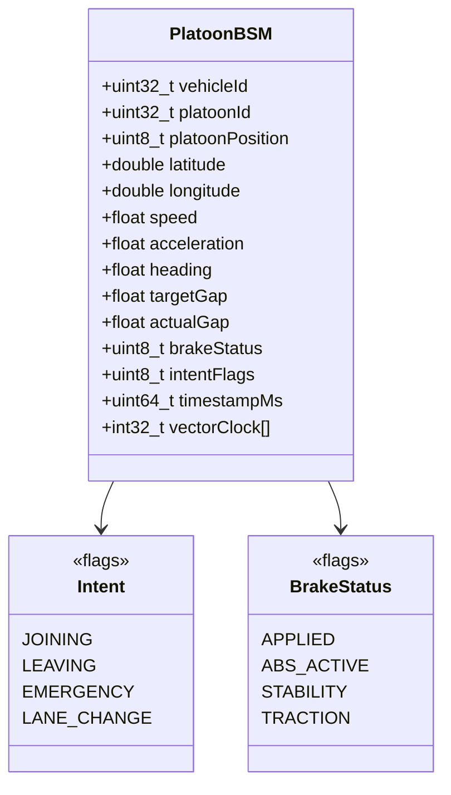

# Platooning System Architecture

## System Overview

```
┌──────────────────────────────────────────────────────────────────────────────┐
│                         PLATOONING SYSTEM                                    │
│                                                                              │
│   ┌─────────────┐          UDP (port 8080)           ┌─────────────┐         │
│   │   LEADER    │◄──────────────────────────────────►│  FOLLOWER   │         │
│   │  (lead.cpp) │         WireMessage                │ (follow.cpp)│         │
│   └─────────────┘                                    └─────────────┘         │
│         ▲                                                   ▲                │
│         │                                                   │                │
│         ▼                                                   ▼                │
│   ┌─────────────┐                                    ┌─────────────┐         │
│   │  FOLLOWER   │                                    │  FOLLOWER   │         │
│   │ (follow.cpp)│                                    │ (follow.cpp)│         │
│   └─────────────┘                                    └─────────────┘         │
│                                                                              │
└──────────────────────────────────────────────────────────────────────────────┘
```

---

## Component Diagram (Mermaid)



---

## Message Protocol



---

## Communication Sequence



---

## State Machine



---

## Thread Model



---

## Matrix Clock Synchronization



---

## File Structure

```
Platooning_System/
├── message.h         # Shared wire protocol (WireMessage, MsgType, Flags)
├── lead.h            # Leader class declaration
├── lead.cpp          # Leader implementation
├── follow.h          # Follower class declaration
├── follow.cpp        # Follower implementation
├── README_RUN.md     # Build & run instructions
├── ARCHITECTURE.md   # This file
│
└── dsrc/             # 🆕 DSRC V2V Refactored Version
    ├── bsm.h         # Basic Safety Message (SAE J2735 inspired)
    ├── vehicle.h     # Unified vehicle node
    ├── vehicle.cpp   # Vehicle implementation
    ├── main.cpp      # Entry point
    ├── Makefile      # Build system
    └── README.md     # DSRC-specific docs
```

---

## Quick Reference

| Component | Port | Protocol | Key Features |
|-----------|------|----------|--------------|
| Leader    | 8080 | UDP      | Receive from followers, broadcast state, monitor heartbeats |
| Follower  | ephemeral | UDP | Send to leader, receive broadcasts, PID control |

| Message Type    | Direction       | Purpose |
|-----------------|-----------------|---------|
| JOIN            | Follower→Leader | Request to join platoon |
| JOIN_ACK        | Leader→Follower | Assign clock index |
| LEAVE           | Follower→Leader | Graceful departure |
| LEADER_STATE    | Leader→Follower | Broadcast position/speed |
| FOLLOWER_STATE  | Follower→Leader | Heartbeat + state update |

---

## DSRC V2V Version (Recommended for Real-World)

The `dsrc/` folder contains a refactored version using UDP broadcast, which is more suitable for real V2V/DSRC deployment.

### Key Differences

| Aspect | Main Version | DSRC Version |
|--------|-------------|--------------|
| Transport | UDP (unicast) | **UDP broadcast/multicast** |
| Topology | Star (all → leader) | **Mesh** (all hear all) |
| Binary | Separate `lead` + `follow` | **Single `platoon`** |
| Leadership | Fixed leader server | **Position-based** (auto failover) |
| Message | Custom `WireMessage` | **BSM** (SAE J2735 inspired) |
| Frequency | Variable | **10 Hz** (DSRC standard) |

### DSRC Architecture



### Leader Failover



### Build & Run DSRC Version

```bash
cd dsrc
make

# Terminal 1 - Leader
./platoon 1 100 0

# Terminal 2 - Follower
./platoon 2 100 1

# Terminal 3 - Follower
./platoon 3 100 2
```

### BSM Message Format


