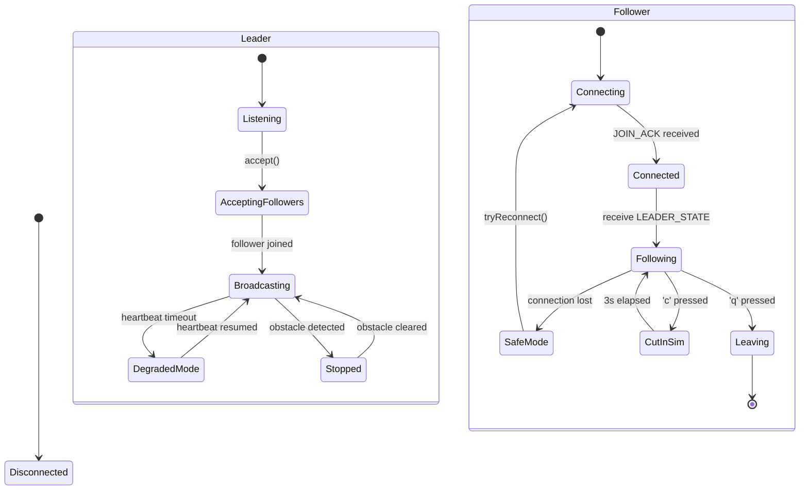
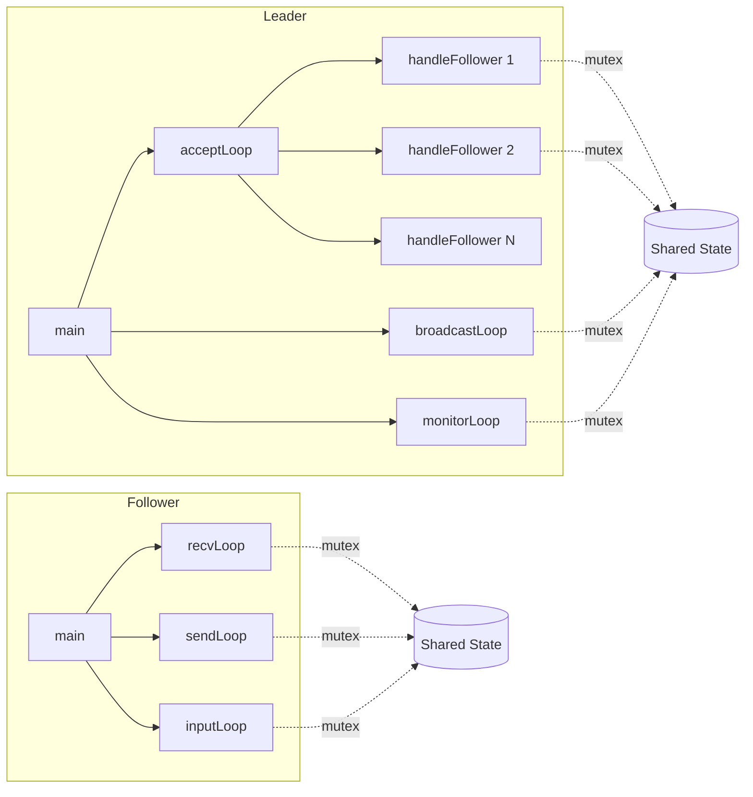

# Platooning System Architecture

## System Overview

```
┌──────────────────────────────────────────────────────────────────────────────┐
│                         PLATOONING SYSTEM                                    │
│                                                                              │
│   ┌─────────────┐         TCP/IP (port 8080)         ┌─────────────┐        │
│   │   LEADER    │◄──────────────────────────────────►│  FOLLOWER   │        │
│   │  (lead.cpp) │         WireMessage                │ (follow.cpp)│        │
│   └─────────────┘                                    └─────────────┘        │
│         ▲                                                   ▲               │
│         │                                                   │               │
│         ▼                                                   ▼               │
│   ┌─────────────┐                                    ┌─────────────┐        │
│   │  FOLLOWER   │                                    │  FOLLOWER   │        │
│   │ (follow.cpp)│                                    │ (follow.cpp)│        │
│   └─────────────┘                                    └─────────────┘        │
│                                                                              │
└──────────────────────────────────────────────────────────────────────────────┘
```

---

## Component Diagram (Mermaid)

```mermaid
flowchart TB
    subgraph Leader["🚗 Leader Vehicle (lead.cpp)"]
        LS[Server Socket<br/>Port 8080]
        LM[Mutex Lock]
        LC[Matrix Clock<br/>MAX_NODES x MAX_NODES]
        
        subgraph LThreads["Threads"]
            AT[Accept Thread]
            BT[Broadcast Thread]
            MT[Monitor Thread]
            HT[Handler Threads<br/>per follower]
        end
        
        LState["State:<br/>• position<br/>• speed<br/>• obstacle flag<br/>• degraded mode"]
    end

    subgraph Follower["🚙 Follower Vehicle (follow.cpp)"]
        FS[TCP Socket]
        FM[Mutex Lock]
        FC[Matrix Clock<br/>MAX_NODES x MAX_NODES]
        
        subgraph FThreads["Threads"]
            RT[Recv Thread]
            ST[Send Thread]
            IT[Input Thread]
        end
        
        FState["State:<br/>• position<br/>• speed<br/>• PID controller<br/>• cut-in flag"]
    end

    Leader <-->|WireMessage| Follower
```



---

## Message Protocol


---

## Communication Sequence

```mermaid
sequenceDiagram
    participant F as Follower
    participant L as Leader

    Note over F,L: Join Phase
    F->>L: JOIN (senderId, position, speed)
    L->>F: JOIN_ACK (assignedIndex)

    Note over F,L: Normal Operation
    loop Every broadcast interval
        L->>F: LEADER_STATE (position, speed, clock)
    end

    loop Heartbeat
        F->>L: FOLLOWER_STATE (position, speed, clock)
    end

    Note over F,L: Obstacle Detection
    F->>L: FOLLOWER_STATE (obstacle=1)
    L->>F: LEADER_STATE (speed=0, obstacle=1)

    Note over F,L: Cut-in / Partition
    F--xL: Heartbeat paused (3s)
    L->>L: Timeout → Degraded Mode
    L->>F: LEADER_STATE (FLAG_DEGRADED)
    F->>L: FOLLOWER_STATE resumed
    L->>L: Clear degraded mode

    Note over F,L: Leave Phase
    F->>L: LEAVE
    L->>L: Remove follower from registry
```



---

## State Machine



---

## Thread Model



---

## Matrix Clock Synchronization


---

## File Structure

```
Platooning_System/
├── message.h       # Shared wire protocol (WireMessage, MsgType, Flags)
├── lead.h          # Leader class declaration
├── lead.cpp        # Leader implementation
├── follow.h        # Follower class declaration
├── follow.cpp      # Follower implementation
├── README_RUN.md   # Build & run instructions
└── ARCHITECTURE.md # This file
```

---

## Quick Reference

| Component | Port | Protocol | Key Features |
|-----------|------|----------|--------------|
| Leader    | 8080 | TCP      | Accept followers, broadcast state, monitor heartbeats |
| Follower  | -    | TCP      | Connect to leader, PID control, send heartbeat |

| Message Type    | Direction       | Purpose |
|-----------------|-----------------|---------|
| JOIN            | Follower→Leader | Request to join platoon |
| JOIN_ACK        | Leader→Follower | Assign clock index |
| LEAVE           | Follower→Leader | Graceful departure |
| LEADER_STATE    | Leader→Follower | Broadcast position/speed |
| FOLLOWER_STATE  | Follower→Leader | Heartbeat + state update |
