# Distributed Platoon System v2 - Diagrams

## 1. System Architecture Overview


---

## 2. Thread Pipeline (Per Vehicle)

```mermaid
flowchart LR
    subgraph "Single Vehicle Process"
        direction TB
        
        subgraph SENSOR["🔍 Sensor Thread"]
            S1[Measure Gap<br/>to Predecessor]
            S2[Calculate<br/>Relative Speed]
            S3[Obstacle<br/>Detection]
        end
        
        subgraph DECISION["🧠 Decision Thread"]
            D1[Emergency<br/>Check]
            D2[Coupling<br/>Logic]
            D3[Leader<br/>Election]
            D4[PD Controller<br/>Calculate Accel]
        end
        
        subgraph CONTROL["⚙️ Control Thread"]
            C1[Apply<br/>Acceleration]
            C2[Update<br/>Position/Speed]
            C3[Speed<br/>Limiting]
        end
        
        subgraph COMM["📡 Comm Thread"]
            CM1[Receive<br/>Messages]
            CM2[Send<br/>Heartbeats]
            CM3[Process<br/>Requests]
        end
        
        STATE[(Shared State<br/>VehicleData)]
    end
    
    S1 --> STATE
    S2 --> STATE
    S3 --> STATE
    
    STATE --> D1
    STATE --> D2
    STATE --> D3
    STATE --> D4
    
    D4 --> STATE
    
    STATE --> C1
    C1 --> C2
    C2 --> STATE
    
    CM1 --> STATE
    STATE --> CM2
    CM3 --> STATE
    
    IPC[("🌐 IPC<br/>Message Queues")]
    
    CM1 <--> IPC
    CM2 --> IPC
```



---

## 3. Message Flow Sequence Diagram


---

## 4. Leader Election Sequence


---

## 5. Vehicle State Machine


---

## 6. Component Diagram


---

## 7. Data Flow Diagram


---

## 8. Platoon Formation


---

## 9. Process Spawning (Launcher)

```mermaid
flowchart TB
    START([Start Launcher])
    PARSE[Parse Arguments<br/>num_vehicles]
    CLEANUP[Cleanup Old<br/>Message Queues]
    
    subgraph FORK_LOOP["Fork Loop (i = 0 to N-1)"]
        FORK[fork()]
        CHILD{Child?}
        EXEC[exec ./vehicle i N]
        SAVE_PID[Save PID]
        DELAY[Sleep 200ms]
    end
    
    MONITOR[Monitor Loop]
    CHECK_CHILD{Child<br/>Exited?}
    CHECK_SIGNAL{SIGINT<br/>Received?}
    LOG[Log Exit]
    
    STOP_ALL[Send SIGTERM<br/>to All Children]
    WAIT_ALL[waitpid() for All]
    CLEANUP_END[Cleanup Queues]
    DONE([Exit])
    
    START --> PARSE
    PARSE --> CLEANUP
    CLEANUP --> FORK
    
    FORK --> CHILD
    CHILD -->|"Yes (pid=0)"| EXEC
    CHILD -->|"No (pid>0)"| SAVE_PID
    SAVE_PID --> DELAY
    DELAY --> FORK
    
    DELAY -.->|"Loop complete"| MONITOR
    
    MONITOR --> CHECK_CHILD
    CHECK_CHILD -->|"Yes"| LOG
    LOG --> MONITOR
    CHECK_CHILD -->|"No"| CHECK_SIGNAL
    CHECK_SIGNAL -->|"No"| MONITOR
    CHECK_SIGNAL -->|"Yes"| STOP_ALL
    
    STOP_ALL --> WAIT_ALL
    WAIT_ALL --> CLEANUP_END
    CLEANUP_END --> DONE
```

---

## 10. PD Controller Block Diagram

```mermaid
flowchart LR
    subgraph "Inputs"
        DESIRED[Desired Gap<br/>10m]
        ACTUAL[Actual Gap<br/>sensor_gap]
        REL_V[Relative Speed<br/>sensor_rel_speed]
    end
    
    subgraph "PD Controller"
        ERROR["Error<br/>e = gap - desired"]
        KP["Kp × e<br/>(Kp = 0.5)"]
        KD["Kd × rel_speed<br/>(Kd = 0.3)"]
        SUM["Σ"]
        CLAMP["Clamp<br/>±3 m/s²"]
    end
    
    subgraph "Output"
        CMD[cmd_accel]
    end
    
    DESIRED --> ERROR
    ACTUAL --> ERROR
    ERROR --> KP
    REL_V --> KD
    KP --> SUM
    KD --> SUM
    SUM --> CLAMP
    CLAMP --> CMD
    
    style DESIRED fill:#dfd,stroke:#333
    style ACTUAL fill:#ffd,stroke:#333
    style CMD fill:#fdd,stroke:#333
```



---

## 11. Synchronization Primitives


---

## 12. Message Types


---

## 13. Deployment Diagram


---

## 14. Class Diagram (Data Structures)


---

## 15. Timing Diagram


---

## Viewing These Diagrams

These diagrams use **Mermaid** syntax. To view them:

1. **VS Code**: Install "Markdown Preview Mermaid Support" extension
2. **GitHub**: Diagrams render automatically in markdown files
3. **Online**: Use [Mermaid Live Editor](https://mermaid.live/)
4. **Export**: Use `mmdc` CLI tool to export as PNG/SVG

```bash
# Install mermaid CLI
npm install -g @mermaid-js/mermaid-cli

# Export diagram
mmdc -i DIAGRAMS.md -o output.png
```
